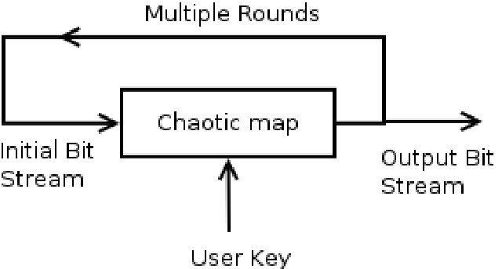

# Encryption And Decryption Using ChaoticKeySequence
python based repo for Encryption and Decryption using advance crypto technic called Chaotic Key Sequence

The basic principle of encryption with chaos is based on the ability of some dynamic systems to produce sequence of numbers that are random in nature. This sequence is used to encrypt messages. For decryption, the sequence of random numbers is highly dependent on the initial condition used for generating this sequence. A very minute deviation in the initial condition will result in a totally different sequence. This sensitivity to initial condition makes chaotic systems ideal for encryption.

## simply explain process of core key generation of ecryption and decryption

Every pixel of and image get key for encryption that's why this algo is so strong for CryptoGraphy.

## full pipeline of encryption and decryption

