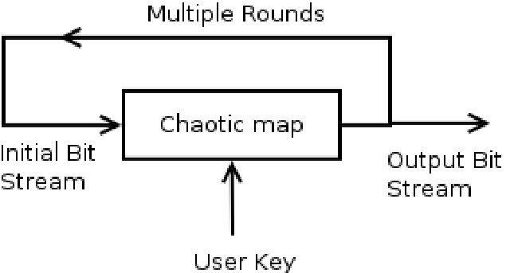
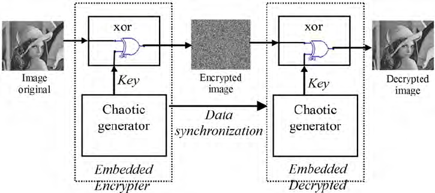
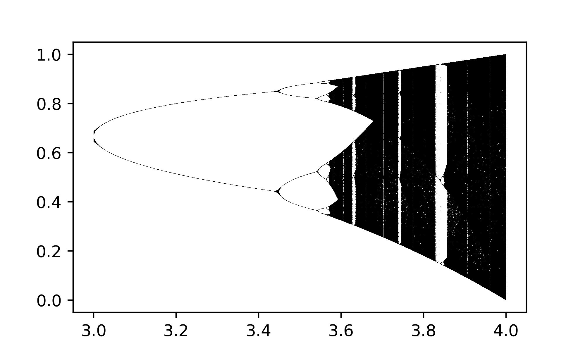

# Encryption And Decryption Using ChaoticKeySequence
The encryption and decryption project using chaotic key sequences aims to create a secure and robust cryptographic system by leveraging chaos theory. This method of encryption relies on dynamic systems that can generate sequences of numbers with a random-like nature. These numbers are then utilized as keys to modify the pixel values of an image. The implementation of this project involves the use of web technologies.

The basic principle of encryption with chaos is based on the ability of some dynamic systems to produce sequence of numbers that are random in nature. This sequence is used to encrypt an image. For decryption, the sequence of random numbers is highly dependent on the initial condition used for generating this sequence. A very minute deviation in the initial condition will result in a totally different sequence. This sensitivity to initial condition makes chaotic systems ideal for encryption.

## simply explain process of core key generation of ecryption and decryption

Every pixel of and image get key for encryption that's why this algo is so strong for CryptoGraphy.

## full pipeline of encryption and decryption

# Run the project 
First of all install python dependencies 
> $ pip install -r requirements.txt

Then Run the flask server 
> $ python app.py

Project will be running on this server 
> $ Running on http://127.0.0.1:5000

# To encrypt an original Image

# To Decrypt an Encrypted Image

# **Bifurcation diagram** 

a [**bifurcation diagram**](https://github.com/adam-p/markdown-here/wiki/Markdown-Cheatsheet) the values visited or approached asymptotically (fixed points, [periodic orbits](https://en.m.wikipedia.org/wiki/Periodic_orbit), or [chaotic](https://en.m.wikipedia.org/wiki/Chaos_(mathematics))[attractors](https://en.m.wikipedia.org/wiki/Attractor)) of a system as a function of a [bifurcation parameter](https://en.m.wikipedia.org/wiki/Bifurcation_theory) in the system.

A [Bifurcation Diagram](https://en.m.wikipedia.org/wiki/Bifurcation_diagram) shows that the stability of a system can be highly dependant on the inputs.

It is calculated by looping the folowing equation, for a number of iterations, and every `r` in a defined range. Then the results are plotted with each `r` on the x-axis, and `x` on the y-axis 

Then the results are plotted with each `r` on the x-axis, and `x` on the y-axis, resulting in the following diagram.

* Minimum_r = 3.0
* Maximum_r = 4.0
* Max_itermations = 1000
* Skip_itermations = 100
* Step_r = 0.0001

